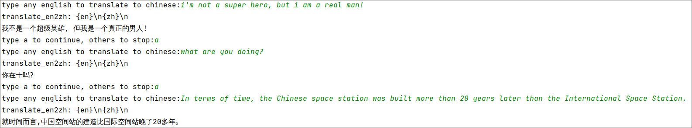

# Multi language version translation

this project is a bookstore web application which can manage multi language version for translation.

## effect and structure

### frontend

this is the home page of our website.

### backend

this is how the backend structed.

### Database

this is how mysql database organized.

each book in sql is mapped from the root book in redis.

this is how redis database organized.

### transformer translate

this is the example of ai translate

## how to use

install pyenv and pipenv in your distribution.

and then do following command to init python venv:

'''bash

pyenv install 3.11.3

cd path/of/this/project

pyenv local 3.11.3

pipenv install

'''

run backend:

'''bash

pipenv run python manage.py &

'''

run frontend:

'''bash

'''